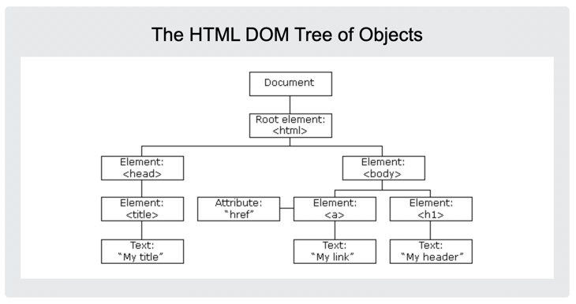

# Content Links

- JS Home - https://www.w3schools.com/js/default.asp
- JS Introduction - https://www.w3schools.com/js/js_intro.asp
- JS Where To - https://www.w3schools.com/js/js_whereto.asp
- JS Output - https://www.w3schools.com/js/js_output.asp
- JS Document Object Model (DOM) - https://www.w3schools.com/js/js_htmldom.asp

# Content

## Introduction: Why Study JavaScript?

- JavaScript is the world's most popular programming language.
- JavaScript is the programming language of the Web.
- JavaScript is easy to learn.

JavaScript is one of the 3 languages all web developers must learn:

1. HTML to define the content of web pages
2. CSS to specify the layout of web pages
3. JavaScript to program the behavior of web pages

## Where To Add JavaScript

### The `<script>` Tag

In HTML, JavaScript code is inserted between `<script></script>` tags.

### JavaScript Functions and Events

A JavaScript function is a block of JavaScript code, that can be executed when "called" for. For 
example, a function can be called when an event occurs, like when the user clicks a button.

### JavaScript in `<head>` or `<body>`

You can place any number of scripts in an HTML document. Scripts can be placed in the `<body>`, 
or in the `<head>` section of an HTML page, or in both.

### External JavaScript

Scripts can also be placed in external files. External scripts are practical when the same code 
is used in multiple web pages.

A JavaScript file has the file extension `.js`. To use an external script, put the name of the 
script file in the `src` (source) attribute of a `<script>` tag:

```
<script src="myScript.js"></script>
```

## Document Object Model (DOM)


When a web page is loaded, the browser creates a `Document Object Model` of the page. The `HTML DOM` 
model is constructed as a tree of `Objects`. Elements are the tree of html tags. Elements can have 
attributes such as `href`, `id`, or `class`.

Dynamic web applications use JavaScript to access and manipulate objects in the DOM in different ways.
  


- JavaScript can change all the HTML elements in the page
- JavaScript can change all the HTML attributes in the page
- JavaScript can change all the CSS styles in the page
- JavaScript can remove existing HTML elements and attributes
- JavaScript can add new HTML elements and attributes
- JavaScript can react to all existing HTML events in the page
- JavaScript can create new HTML events in the page